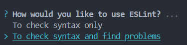
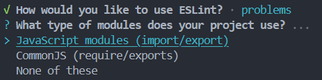
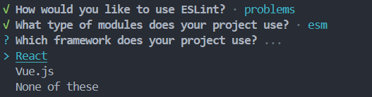
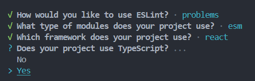
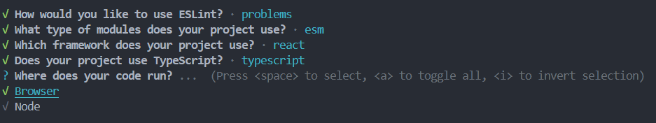
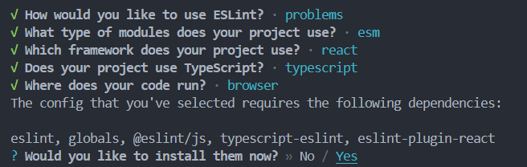
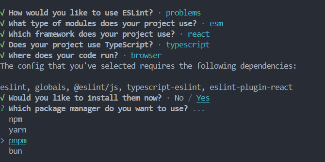

## 关于代码规范

### 1. **通过 CRA (Create React App) 创建项目**
使用 Create React App (CRA) 创建 React 项目，适用于想要快速设置 TypeScript 支持的 React 应用。

#### 步骤：
1. 打开终端并运行以下命令创建 React + TypeScript 项目：

   ```bash
   npx create-react-app react-ts-demo --template typescript
   ```

2. 进入项目目录并启动项目：

   ```bash
   cd react-ts-demo
   pnpm start  # 或者使用 npm start / yarn start
   ```

3. 项目启动后，React 开发服务器将在浏览器中打开，默认端口为 `http://localhost:3000`。

4. eslint
  
   ```bash
    pnpm add eslint eslint-config-react-app @typescript-eslint/parser @typescript-eslint/    eslint-plugin --save-dev

    npx eslint --init
   ```







安装 vscode 插件 `eslint` ，此时就可以看到代码 `App.txs` 中的错误提示（如定义一个未使用的变量）

5. prettier
```
npm install prettier eslint-config-prettier eslint-plugin-prettier -save-dev
```
安装 vscode 插件 `prettier` ，此时可以看到代码 `App.txs` 中的格式提示（如末尾是否使用 `;` ，或单引号、双引号）